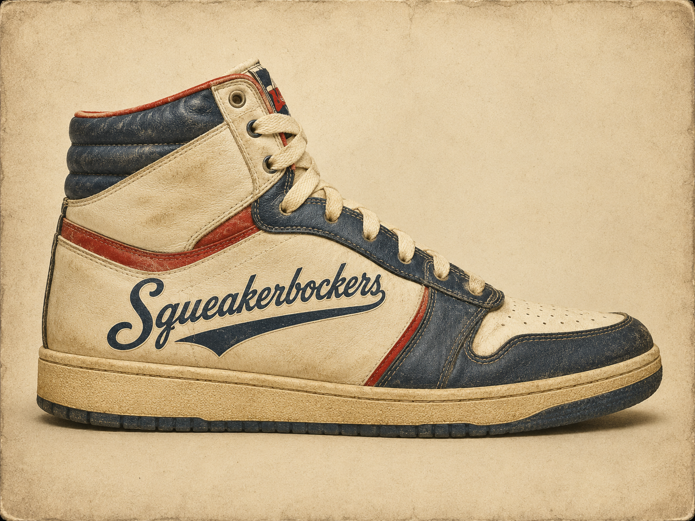

<p align="center">
  
</p>

# Squeakerbockers

> *Audio: generated. Garden: implied. Knicks: forever.*

A realtime generative-audio toy for the **Hugging Face "Build Small" hackathon**
([build-small-hackathon on HF](https://huggingface.co/build-small-hackathon)) —
**Track Two: *An Adventure in Thousand Token Wood***.

People walk in front of a webcam. A pose model tracks how they move. Those
movement features drive a [RAVE](https://github.com/acids-ircam/RAVE) neural audio
model, fine-tuned on shoe squeaks and court foley, which **synthesizes** the
squeaks in realtime. The room sounds like a basketball court. The audio is
generated, not sampled.

Named for the New York **Knickerbockers** — whose sneakers squeak on the Garden
floor. We considered Madison Squeak Garden. We are still considering Madison
Squeak Garden.

---

## How it works

```
   webcam frames ─► YOLO pose ─► movement features ─► shared state
                                                          │
                                              latest features
                                                          ▼
                          control mapping ─► RAVE latent ─► RAVE.decode ─► audio out
```

Two decoupled loops: video at camera FPS (pose, features, skeleton overlay) and
audio at audio rate (control → latent → RAVE decode → continuous chunks). Both
share state through a small `state.py`. Transport is **FastRTC** with an
`AsyncAudioVideoStreamHandler` running `audio-video send-receive`.

The character of the sound lives in `control.py`. Pivots screech. Stillness
fades out. Pan tracks where you are in the frame. Proximity sets volume.

See [`SPEC.md`](./SPEC.md) for the full architecture and build phases.

---

## Models and the parameter budget

| Component | Model | Params |
| --- | --- | --- |
| Pose | [ultralytics yolo11n-pose](https://docs.ultralytics.com/models/yolo11/) | ~3M |
| Audio | [RAVE v2](https://github.com/acids-ircam/RAVE), fine-tuned on court foley | tens of M |
| **Total** | — | **≪ 32B** (the hackathon cap is not the bottleneck here) |

Placeholder model during development:
[`birds_dawnchorus_b2048_r48000_z8.ts`](https://huggingface.co/Intelligent-Instruments-Lab/rave-models)
from Intelligent-Instruments-Lab — chosen because the streaming export is
confirmed and the latent dim is small (z=8). Swap is a one-line `config.py`
change once the squeak model lands.

---

## Run it locally

```bash
uv sync
mkdir -p models
curl -L -o models/birds_dawnchorus_b2048_r48000_z8.ts \
  "https://huggingface.co/Intelligent-Instruments-Lab/rave-models/resolve/main/birds_dawnchorus_b2048_r48000_z8.ts"
uv run python app.py
```

Open `http://127.0.0.1:7860`, grant camera access, and start moving. Local will
feel tight; a deployed Hugging Face Space adds a WebRTC round-trip and will
feel laggier. The demo video is captured locally.

---

## Badges chased

- **Off the Grid** — pose and audio models both run locally; no cloud API in the loop.
- **Well-Tuned** — the fine-tuned RAVE model is published on Hugging Face.
- **Off-Brand** — Knicks-themed custom UI past stock Gradio (orange `#F58426`, the Garden's blue, court-floor accents).
- **Field Notes** — short build log in the [HF blog](https://huggingface.co/blog).

---

## Credits

- **Pose model:** [ultralytics yolo11n-pose](https://github.com/ultralytics/ultralytics) (AGPL).
- **Audio model:** [RAVE](https://github.com/acids-ircam/RAVE) by ACIDS-IRCAM (Antoine Caillon, Philippe Esling).
- **Placeholder model:** [Intelligent-Instruments-Lab/rave-models](https://huggingface.co/Intelligent-Instruments-Lab/rave-models).
- **Transport:** [FastRTC](https://github.com/gradio-app/fastrtc) (gradio-app).
- **UI:** [Gradio](https://www.gradio.app).

---

*New York forever.*
